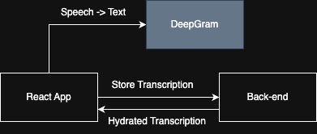

# Call Center Summarizer

This application uses DeepGram to transcribe a conversation in *real-time*.  Upon the completion of the call, multiple LLM based analyses are performed:

1. Success analysis.  Did the call solve the customer's problem?  Also extract the type of problem faced by the customer.
2. Summarization.  A several sentence summary focusing on the issue, actions taken by the agent, and resolution.

## Architecture

### Front-end

The front-end is a React app that connects to the WebSocket based DeepGram API for transcription.  [AGGrid](https://www.ag-grid.com/) is used as the library for the tables.

To store the audio call transcription, and get back the analyses, the front-end app calls several APIs vended by the back-end.  These are REST APIs exposed via AWS API Gateway.  This will be discussed further in the back-end section, the flow is outlined below.

In the front end:
1. The user clicks "Start transcription"
2. The conversation begins over the user's microphone
3. The conversation is transcribed in realtime and appears in a table in the browser.
4. Once the user clicks "Stop transcription", the transcribed conversation is sent to the back-end.
5. In the "Conversations" view in the front-end, the user can view the analyzed conversation which includes the sentiment analysis and summary.